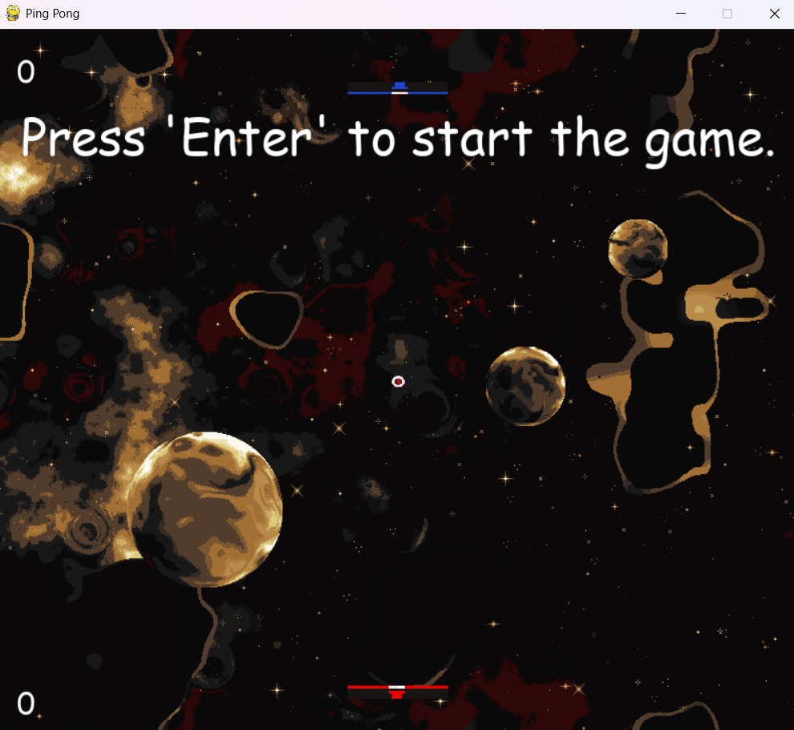

# Vertical-Ping-Pong
Creating a version of the classic Ping Pong Game in which the paddles are at the top and bottom of the window.  
This project was made using the [PyGame](https://wiki.python.org/moin/PyGame) library.

## Screenshot


## How to play?  
- Press **Enter** to start the game.  
- **A** and **D** keys are used to move the upper paddle.  
- **Left** and **Right** arrow keys are used to move the lower paddle.  

## How to run
### 0. Prerequisites
You must have the following installed on your system.
1. [Python](https://www.python.org/)
2. [pip](https://pypi.org/project/pip/)

### 1. Clone the repo
```bash
git clone https://github.com/AuroraChasma/Vertical-Ping-Pong.git
cd Vertical-Ping-Pong
```
### 2. Download the Pygame library
```bash
# Make a virtual environment
python -m venv .venv 

# Activate the virtual environment
# On windows (cmd)
.\.venv\Scripts\activate.bat

# On linux
source ./.venv/bin/activate

# Install pygame using pip
pip install pygame
```
#### 3. Run the program
```bash
python ./src/pingpong.py
```


